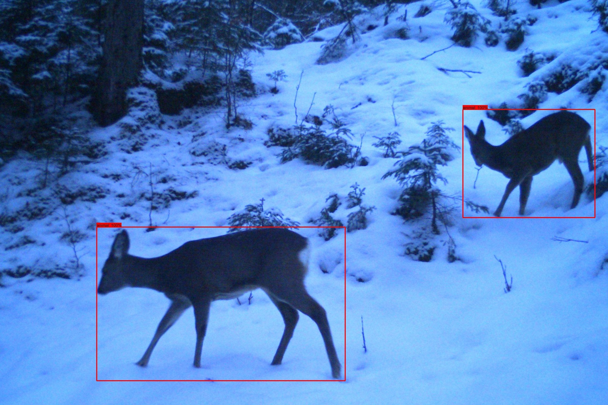
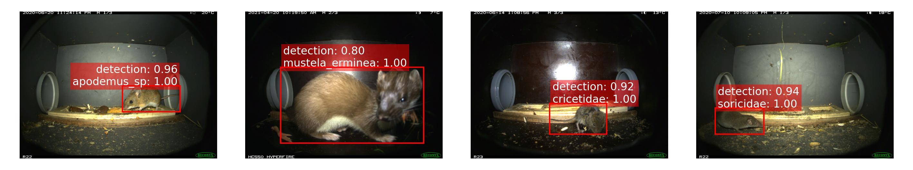
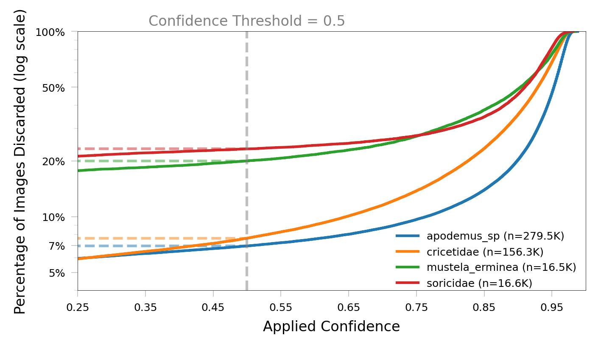

## Presentation of my Bachelor's Thesis

---

## Contents

* Presentation
    - Topic
    - Objectives
    - Methodology
    - Results
    - Outlook / Future Work
* Discussion
* Conclusion and Feedback

Note:
Present the structure of the 30-minute talk.

---

## Topic

----

This is what I signed up for:

*Image: Bavarian State Institute of Forestry (LWF)*

"Tiere in Fotofallendataset mit KI autmatisch erkennen"

----

This is what it turned into:

*Image: Author's own*

"Deep Learning for Biodiversity Monitoring: Automated Classification of Small Mammals Captured in Foto Trap Boxes"

---

## Objectives

----

### These were the core objectives:

- Detect animals in camera trap images  
- Build a preprocessing pipeline  
- Select suitable model architectures  
- Train the classification models  
- Evaluate model performance

---

## Methodology

----

  

    <h3>Detection</h3>
    
Microsoft MegaDetector was used for an initial detection.

  

  

    
  

----

  

    <h3>Selecting</h3>
    
  

  

    
  

----