# Deep Learning for Biodiversity Monitoring

Note:
Titel der Arbeit

---
## Outline

----
  

    
  

Note:
Present the structure of the 30-minute talk.
* Presentation  
  - Topic  
  - Objectives  
  - Methodology  
  - Results  
  - Outlook 
* Discussion  
* Feedback

---
## Topic

----
### What I signed up for
"Tiere in Fotofallendataset mit KI automatisch erkennen"

  
  
Image: Bavarian State Institute of Forestry (LWF)

----
### What it turned into
"Deep Learning for Biodiversity Monitoring: Automated Classification of Small Mammals Captured in Foto Trap Boxes"

  
  
Figure: Author's own example

Note:
Introduce Campus@Wildlife

----
### Relevanz
Deep learning, Small Mammals

---
## Objectives

----
### These were the core objectives:

  

    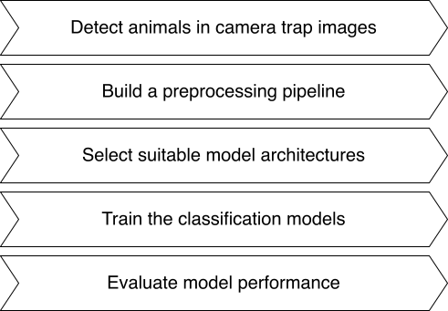
  

<!-- mehr zusammenfassen -->

Note:
- Detect animals in camera trap images
- Build a preprocessing pipeline
- Select suitable model architectures
- Train the classification models
- Evaluate model performance

---
## Methodology

----

  

----

  

    
    
Figure: Percentage of images discarded

  

  

    
  

Note: Explain fig well

----

  

----
### Tested Architectures

  

    
EfficientNet-B0

    
4M

    
Scaled CNN baseline

  

  

    
DenseNet-169

    
12M

    
Dense CNN, feature reuse

  

  

    
ResNet-50

    
23M

    
Residual blocks, deep

  

  

    
ViT-B/16

    
85M

    
Transformer, patch-wise

  

<!-- Get more detail about this -->
<!-- mention pretraining -->

Note:
- Scaled CNN baseline = Efficient scaling across dimensions
- Dense CNN = Feature reuse via dense connections
- Residual blocks = Deep training with residual connections
- Patch-wise transformer = Transformer input via image patches

----
### Cross Validation

----
### Evaluation

<!-- know the metrics -->
Note:
Why different aggregation approaches

---
## Results

----
### Comparing Different Model Architectures

  

    
Table: Balanced accuracy of all models – mean ± standard deviation; best values highlighted

    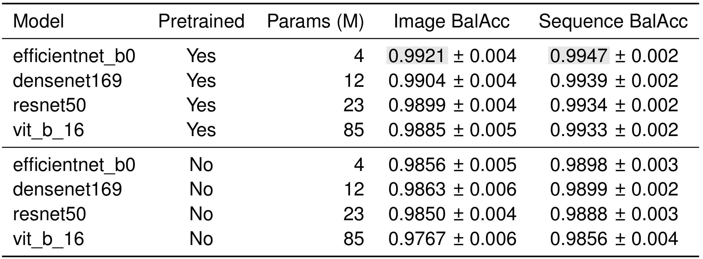
  

  

    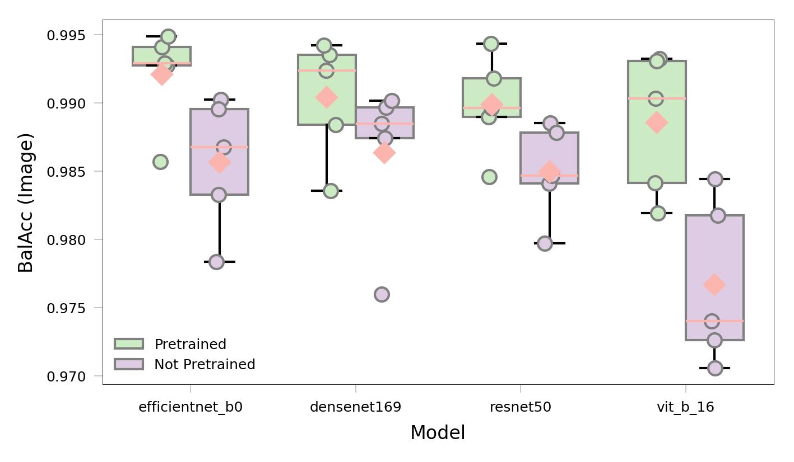
    
Figure: Balanced accuracy across folds

  

----
### Pretrained EfficientNet-B0

  

    
Table: Class-wise precision, recall, F1-score, and support for the pretrained EfficientNet-B0

    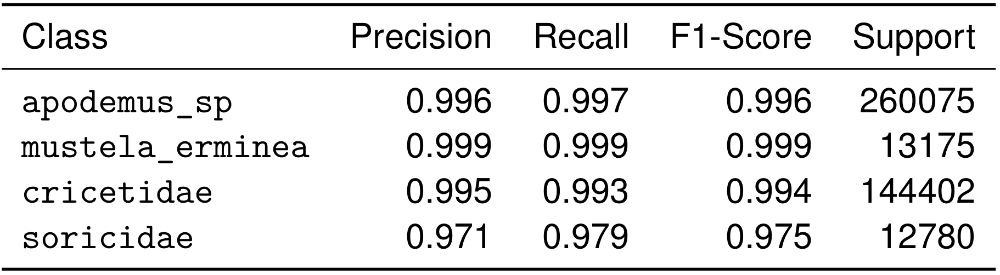
  

  

    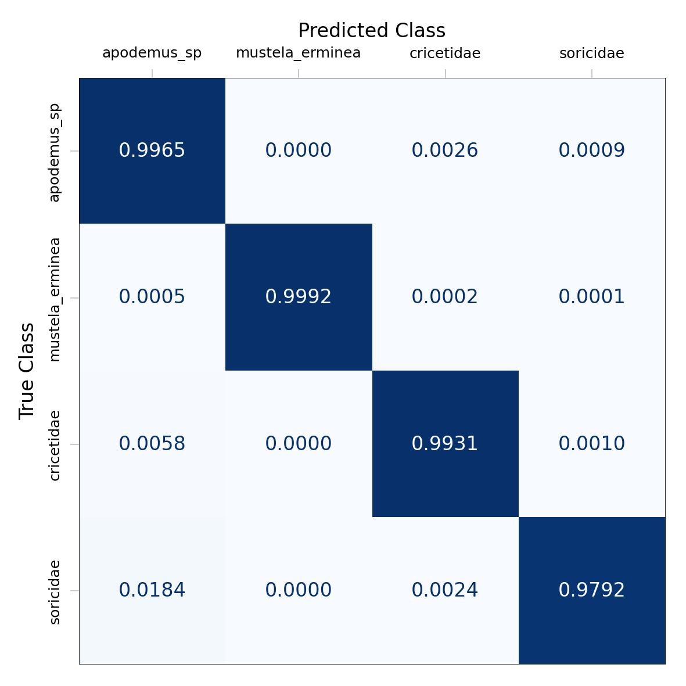
    
Figure: Confusion matrix EfficientNet-B0

  

----
### Stoats: hard to detect – easy to classify

  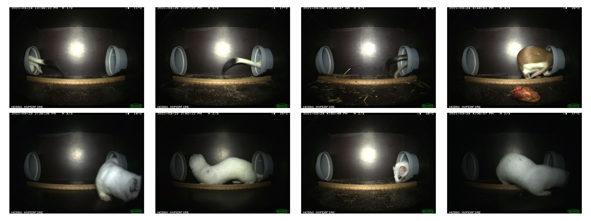
  
Figure: Not detected stoats

----
### Stoats: hard to detect – easy to classify

  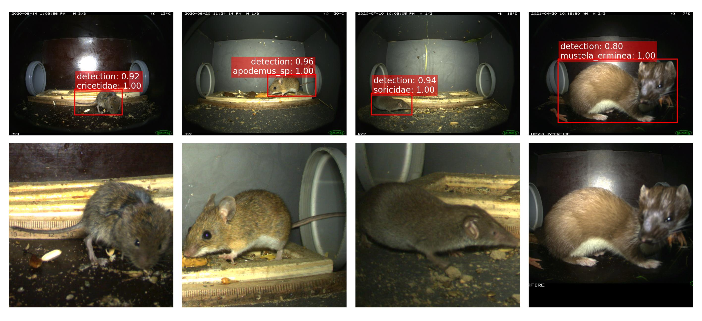
  
Figure: Classification examples

----
### Looking into some errors

  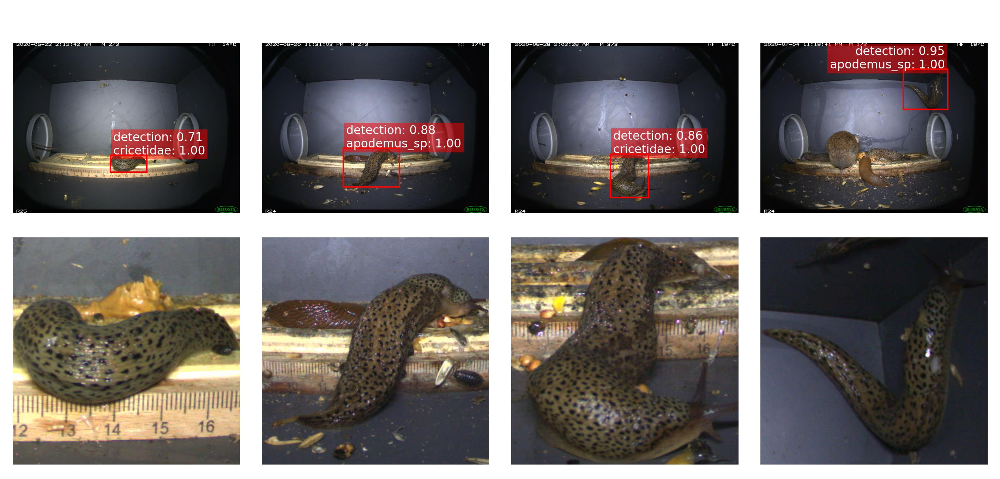
  
Figure: Detected snails – classified as mammals

----
### Looking into some errors

  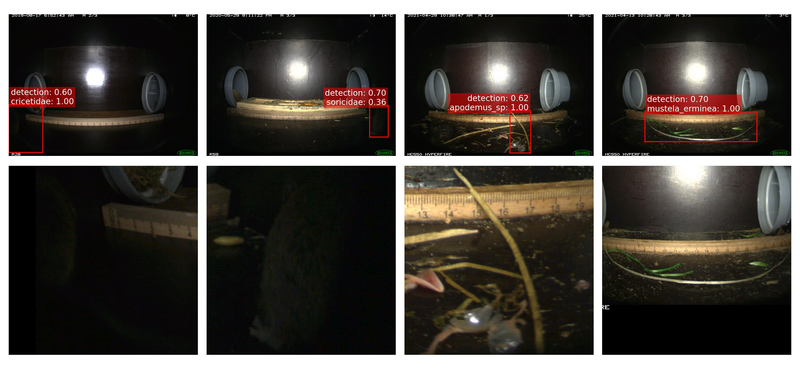
  
Figure: Missed detections

----
### Correlation?

  

    Spearman’s rank correlation:
  

  <ul style="list-style-type: none; padding-left: 0;">
    <li><em>Correctly classified samples</em>: <strong>ρ = 0.092</strong></li>
    <li><em>Incorrectly classified samples</em>: <strong>ρ = 0.276</strong></li>
  </ul>

  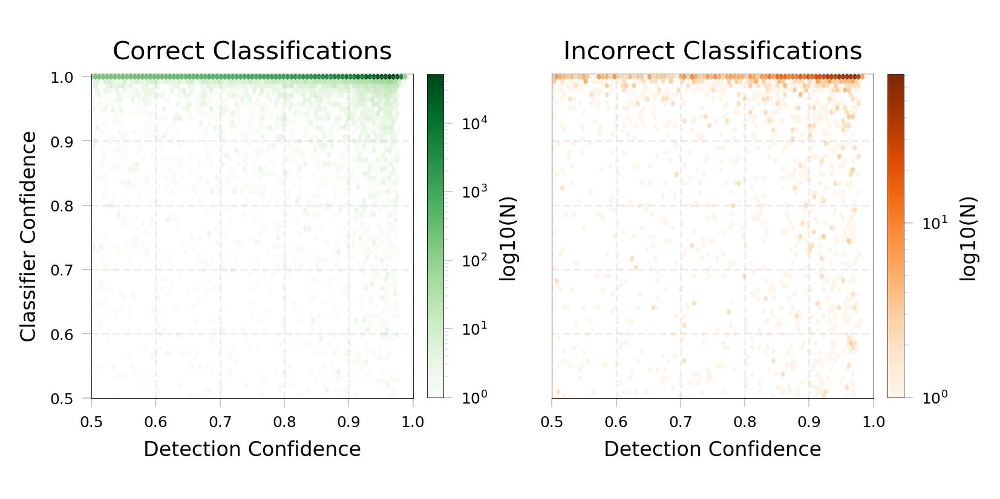
  
Figure: Correlation of detection and classification confidence

---
## Outlook

----
### Directions for Improvements

  

    
  

Notes:
- Introduce a non-target class for OOD detection  
- Add additional species, e.g. _Glis glis_  
- Improve detection quality, e.g. via fine-tuning  
- Explore sequence-aware or temporally informed classification approaches

----
### Automated Sequence Detection

  
Utilizing OCR for sequence detection:

  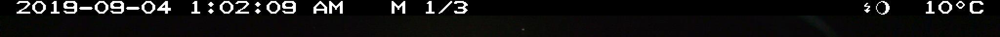
  
Figure: Top strip of a random sample

Output string was:

_2019-09-04 1:02:09 AM M 1/3 #9 10°C_

<!-- ----
### Interface

  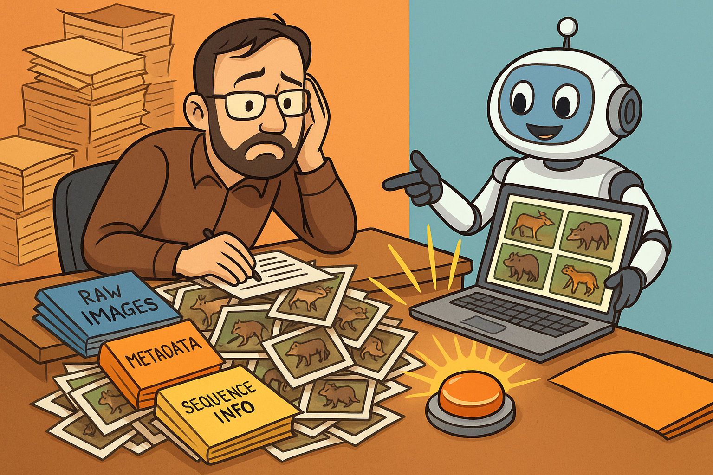
  
Figure: Illustration by ChatGPT 4o

 -->

---
## Discussion

----
<iframe 
  width="90%" 
  height="600" 
  src="https://miro.com/app/live-embed/uXjVIhkMbMs=/?focusWidget=3458764633579243550&embedMode=view_only_without_ui&embedId=494225355739" 
  frameborder="0" 
  scrolling="no" 
  allow="fullscreen; clipboard-read; clipboard-write" allowfullscreen>
</iframe>

---
## Feedback

Note: 