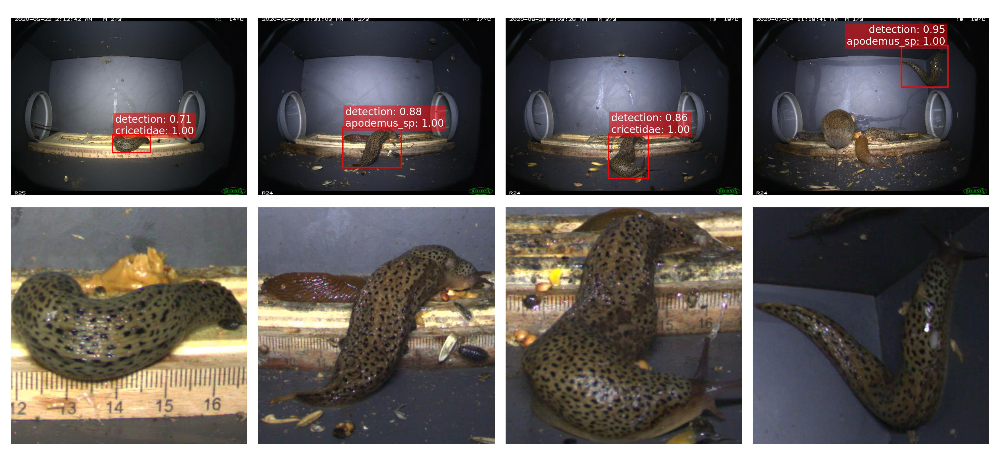

# Presentation Bachelor's Thesis

---

## Contents

----

* Presentation  
    - Topic  
    - Objectives  
    - Methodology  
    - Results  
    - Outlook 
* Discussion  
* Wrap up and Feedback

Note:
Present the structure of the 30-minute talk.

---

## Topic

----

### What I signed up for
"Tiere in Fotofallendataset mit KI autmatisch erkennen"

  
  
Image: Bavarian State Institute of Forestry (LWF)

----

### What it turned into
"Deep Learning for Biodiversity Monitoring: Automated Classification of Small Mammals Captured in Foto Trap Boxes"

  
  
Image: Author's own

---

## Objectives

----

### These were the core objectives:

- Detect animals in camera trap images  
- Build a preprocessing pipeline  
- Select suitable model architectures  
- Train the classification models  
- Evaluate model performance

---

## Methodology

### Processing of a Sequence

----

  
  
Figure: Author's own

----

  

    
    
Figure: Author's own

  

  

    
    
Figure: Author's own

  

----

  
  
Figure: Author's own

---

## Methodology

### Training

----

_**Slides missing – Add content here.**_

---

## Methodology

### Evaluation

----

_**Slides missing – Add content here.**_

---

## Results

----

### Comparing Different Model Architectures

  

    
Table: BalAcc of all models – mean ± standard deviation; best values highlighted.

    
  

  

    
    
Figure: BalAcc

  

----

### Pretrained EfficientNet-B0

  

    
Table: Class-wise precision, recall, F1-score, and support for the pretrained EfficientNet-B0.

    
  

  

    
    
Figure: Confusion Matrix

  

----

### Stoats hard to detect – easy to classify

  
  
Figure: Not detected Stoats

----

### Stoats hard to detect – easy to classify

  
  
Figure: Stoats - Easy to classify

----

### Looking into some errors

  
  
Figure: Detected Snails – Classified as Mammals

---

## Outlook

----

_**Slides missing – Add content here.**_

---

## Discussion

----

_Add your discussion points here._

---

## Wrap up and Feedback

----

_Add your Wrap Up._
